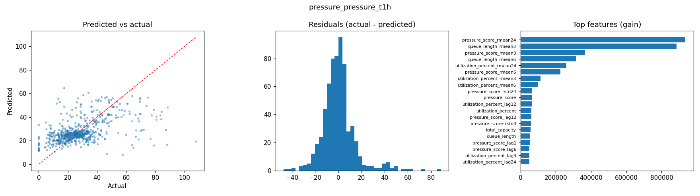
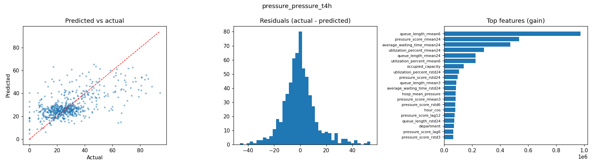
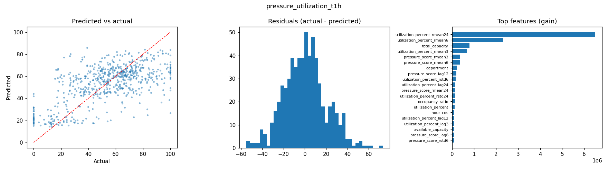
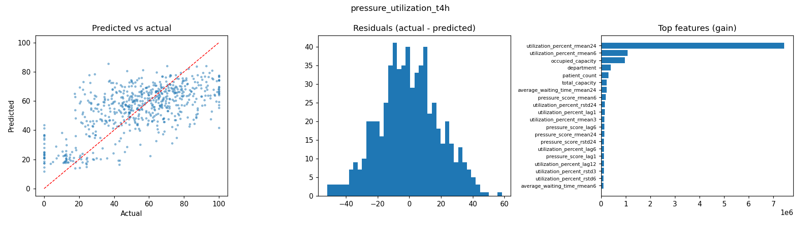
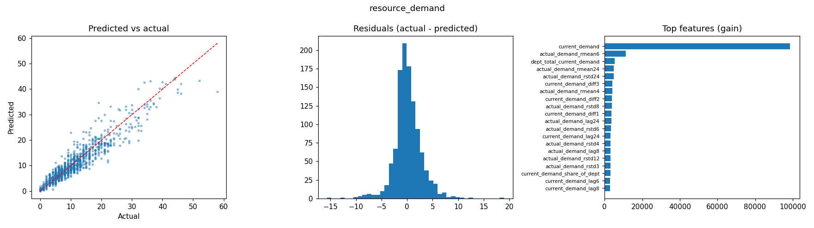
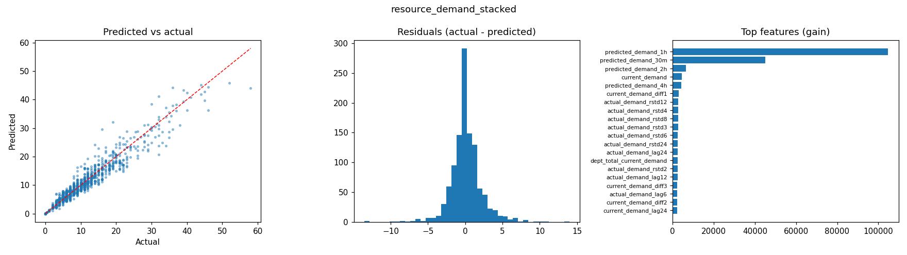
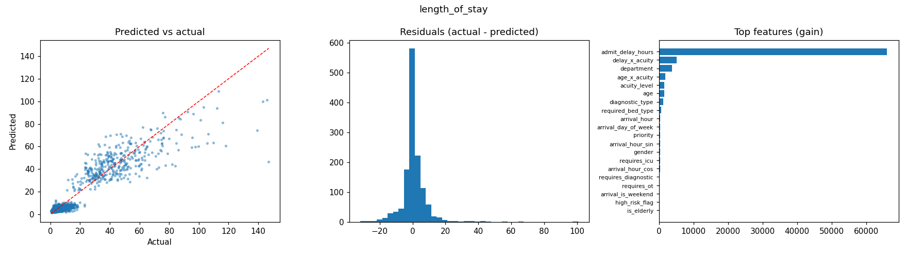
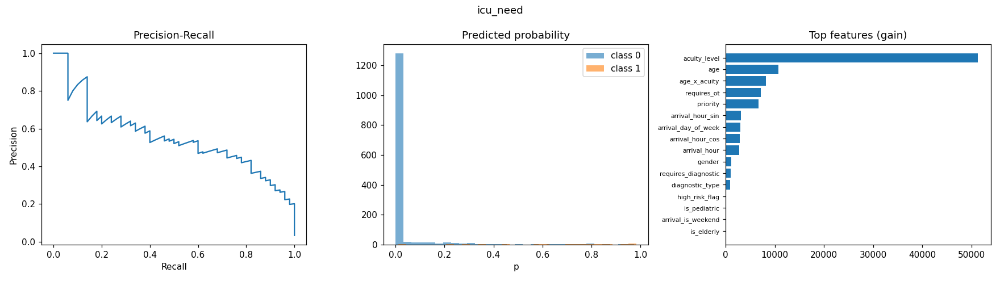
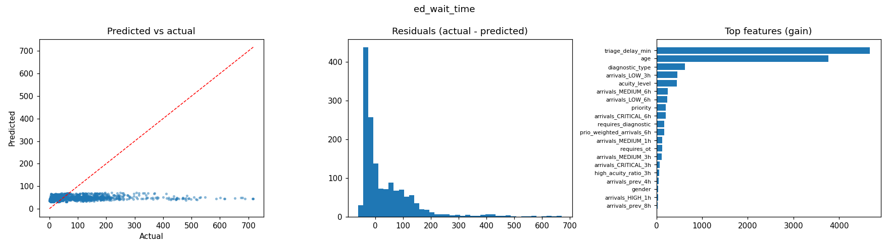
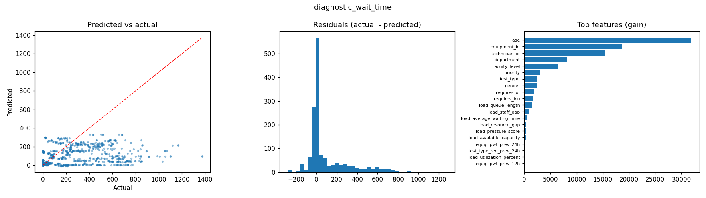

# Medi-Orchestrator — Training Report

Generated 2026-10-04 02:38 · 12 models · 67s total

## Summary

| Model | Target | Train/Val/Test | Key metric | LightGBM | Best baseline | Improvement |
|---|---|---|---|---|---|---|
| `pressure_pressure_t1h` | pressure_score_t1h | 2944/628/636 | MAE | 9.620 | 12.907 | ✅ +25.5% |
| `pressure_pressure_t4h` | pressure_score_t4h | 2945/634/633 | MAE | 9.258 | 12.475 | ✅ +25.8% |
| `pressure_pressure_t24h` | pressure_score_t24h | 2928/633/629 | MAE | 9.992 | 13.363 | ✅ +25.2% |
| `pressure_utilization_t1h` | utilization_percent_t1h | 2944/628/636 | MAE | 15.591 | 20.655 | ✅ +24.5% |
| `pressure_utilization_t4h` | utilization_percent_t4h | 2945/634/633 | MAE | 15.268 | 19.758 | ✅ +22.7% |
| `pressure_utilization_t24h` | utilization_percent_t24h | 2928/633/629 | MAE | 15.410 | 20.769 | ✅ +25.8% |
| `resource_demand` | actual_demand | 5213/1124/1123 | MAE | 1.891 | 1.886 | ❌ -0.3% |
| `resource_demand_stacked` | actual_demand | 5213/1124/1123 | MAE | 1.435 | 1.722 | ✅ +16.6% |
| `length_of_stay` | length_of_stay_hours | 6347/1360/1361 | MAE | 4.571 | 6.318 | ✅ +27.7% |
| `icu_need` | requires_icu | 7000/1500/1500 | ROC_AUC | 0.975 | 0.939 | ✅ +3.7% |
| `ed_wait_time` | waiting_time_minutes | 7000/1498/1502 | MAE | 66.326 | 67.006 | ✅ +1.0% |
| `diagnostic_wait_time` | waiting_time_minutes | 6994/1506/1500 | MAE | 128.768 | 133.542 | ✅ +3.6% |

> Splits are chronological (70/15/15). ED and diagnostic test sets exclude patients seen in training. Data in `data/` is partly synthetic (up-sampled), so treat absolute scores as optimistic.

## pressure_pressure_t1h

Forecast department pressure_score 1h ahead · best iteration 74

| Model | MAE | RMSE | MAPE | R2 |
|---|---|---|---|---|
| Persistence (current value) | 12.907 | 19.208 | 53.0% | -0.405 |
| LightGBM | 9.620 | 14.239 | 43.0% | 0.228 |

Top features: `pressure_score_rmean24`, `queue_length_rmean3`, `pressure_score_rmean3`, `queue_length_rmean6`, `utilization_percent_rmean24`, `pressure_score_rmean6`, `utilization_percent_rmean3`, `utilization_percent_rmean6`

## pressure_pressure_t4h

Forecast department pressure_score 4h ahead · best iteration 119

| Model | MAE | RMSE | MAPE | R2 |
|---|---|---|---|---|
| Persistence (current value) | 12.475 | 18.115 | 55.8% | -0.228 |
| LightGBM | 9.258 | 12.987 | 42.6% | 0.369 |

Top features: `queue_length_rmean6`, `pressure_score_rmean24`, `average_waiting_time_rmean24`, `utilization_percent_rmean24`, `queue_length_rmean24`, `utilization_percent_rmean6`, `occupied_capacity`, `utilization_percent_rstd24`

## pressure_pressure_t24h

Forecast department pressure_score 24h ahead · best iteration 70

| Model | MAE | RMSE | MAPE | R2 |
|---|---|---|---|---|
| Persistence (current value) | 13.363 | 19.385 | 60.7% | -0.340 |
| LightGBM | 9.992 | 14.123 | 46.0% | 0.289 |

Top features: `queue_length_rmean24`, `queue_length_rstd24`, `department`, `utilization_percent_rmean3`, `utilization_percent_rmean24`, `utilization_percent_rstd24`, `pressure_score_rstd24`, `total_capacity`

## pressure_utilization_t1h

Forecast department utilization_percent 1h ahead · best iteration 78

| Model | MAE | RMSE | MAPE | R2 |
|---|---|---|---|---|
| Persistence (current value) | 20.655 | 26.465 | 46.6% | -0.066 |
| LightGBM | 15.591 | 19.918 | 35.5% | 0.396 |

Top features: `utilization_percent_rmean24`, `utilization_percent_rmean6`, `total_capacity`, `utilization_percent_rmean3`, `pressure_score_rmean3`, `pressure_score_rmean6`, `department`, `pressure_score_lag12`

## pressure_utilization_t4h

Forecast department utilization_percent 4h ahead · best iteration 73

| Model | MAE | RMSE | MAPE | R2 |
|---|---|---|---|---|
| Persistence (current value) | 19.758 | 25.407 | 45.5% | -0.020 |
| LightGBM | 15.268 | 19.071 | 35.6% | 0.425 |

Top features: `utilization_percent_rmean24`, `utilization_percent_rmean6`, `occupied_capacity`, `department`, `patient_count`, `total_capacity`, `average_waiting_time_rmean24`, `pressure_score_rmean6`

## pressure_utilization_t24h

Forecast department utilization_percent 24h ahead · best iteration 49

| Model | MAE | RMSE | MAPE | R2 |
|---|---|---|---|---|
| Persistence (current value) | 20.769 | 26.513 | 50.1% | -0.049 |
| LightGBM | 15.410 | 19.330 | 36.2% | 0.442 |

Top features: `department`, `patient_count`, `occupied_capacity`, `utilization_percent_rmean24`, `utilization_percent_rmean3`, `day_of_week`, `average_waiting_time_rmean24`, `average_waiting_time_rstd24`

## resource_demand

Forecast actual resource demand from history only (no external forecasts) · best iteration 498

| Model | MAE | RMSE | MAPE | R2 |
|---|---|---|---|---|
| Persistence (current_demand) | 1.886 | 2.824 | 21.4% | 0.877 |
| LightGBM | 1.891 | 2.716 | 22.8% | 0.886 |

Top features: `current_demand`, `actual_demand_rmean6`, `dept_total_current_demand`, `actual_demand_rmean24`, `actual_demand_rstd24`, `current_demand_diff3`, `actual_demand_rmean4`, `current_demand_diff2`

## resource_demand_stacked

Correct the existing demand forecaster using history (stacked model) · best iteration 438

| Model | MAE | RMSE | MAPE | R2 |
|---|---|---|---|---|
| Persistence (current_demand) | 1.886 | 2.824 | 21.4% | 0.877 |
| Existing forecaster (predicted_demand_30m) | 1.801 | 2.754 | 18.9% | 0.883 |
| Existing forecaster (predicted_demand_1h) | 1.722 | 2.784 | 16.1% | 0.881 |
| LightGBM | 1.435 | 2.202 | 14.7% | 0.925 |

Top features: `predicted_demand_1h`, `predicted_demand_30m`, `predicted_demand_2h`, `current_demand`, `predicted_demand_4h`, `current_demand_diff1`, `actual_demand_rstd12`, `actual_demand_rstd4`

## length_of_stay

Predict inpatient length of stay (hours) at admission · best iteration 485

| Model | MAE | RMSE | MAPE | R2 |
|---|---|---|---|---|
| Median LOS per department | 6.318 | 12.001 | 57.5% | 0.703 |
| LightGBM | 4.571 | 8.337 | 44.3% | 0.857 |

Top features: `admit_delay_hours`, `delay_x_acuity`, `department`, `age_x_acuity`, `acuity_level`, `age`, `diagnostic_type`, `required_bed_type`

## icu_need

Classify whether an arriving patient will need an ICU bed · best iteration 256

| Model | ROC_AUC | PR_AUC | F1_best | Recall_at_90_precision |
|---|---|---|---|---|
| ICU rate per acuity level | 0.939 | 0.425 | 0.596 | 0.000 |
| LightGBM | 0.975 | 0.558 | 0.581 | 0.060 |

Top features: `acuity_level`, `age`, `age_x_acuity`, `requires_ot`, `priority`, `arrival_hour_sin`, `arrival_day_of_week`, `arrival_hour_cos`

## ed_wait_time

Predict ED waiting time (minutes) at arrival · best iteration 12

| Model | MAE | RMSE | MAPE | R2 |
|---|---|---|---|---|
| Median wait per priority | 67.006 | 112.649 | 192.3% | -0.135 |
| LightGBM | 66.326 | 111.526 | 187.6% | -0.112 |

Top features: `triage_delay_min`, `age`, `diagnostic_type`, `arrivals_LOW_3h`, `acuity_level`, `arrivals_MEDIUM_6h`, `arrivals_LOW_6h`, `priority`

## diagnostic_wait_time

Predict diagnostic test waiting time (minutes) at request · best iteration 85

| Model | MAE | RMSE | MAPE | R2 |
|---|---|---|---|---|
| Median wait per test & priority | 133.542 | 250.437 | 115.8% | -0.037 |
| LightGBM | 128.768 | 241.023 | 135.1% | 0.040 |

Top features: `age`, `equipment_id`, `technician_id`, `department`, `acuity_level`, `priority`, `test_type`, `gender`

