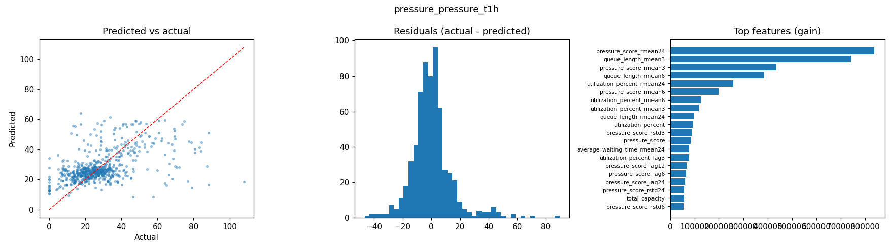
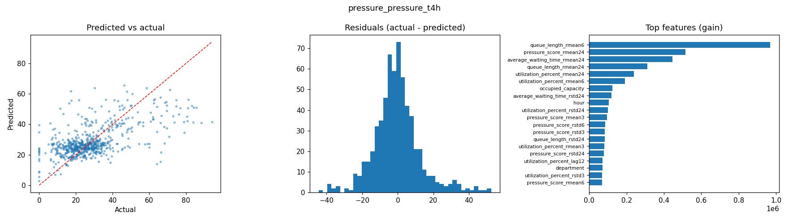
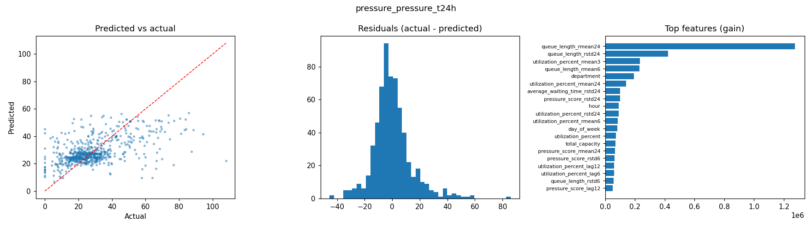
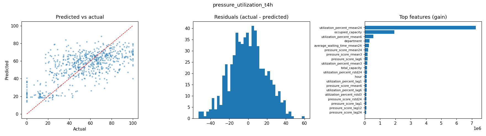
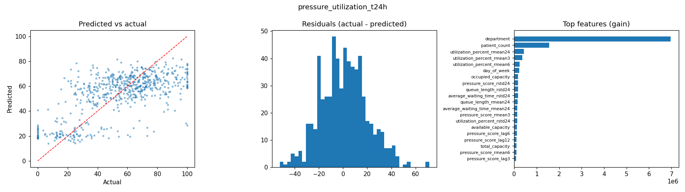
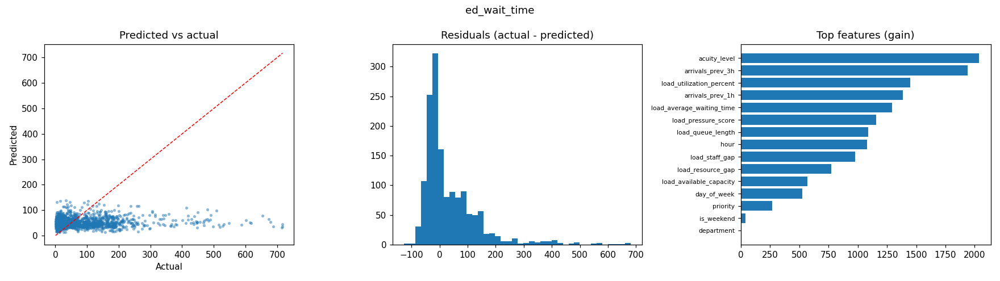
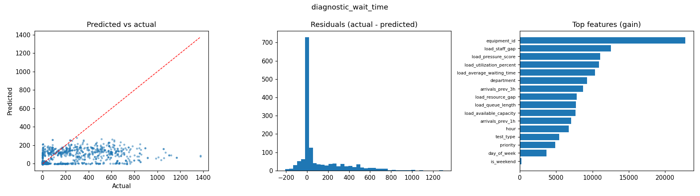

# Medi-Orchestrator — Training Report

Generated 2026-10-04 01:26 · 12 models · 182s total

## Summary

| Model | Target | Train/Val/Test | Key metric | LightGBM | Best baseline | Improvement |
|---|---|---|---|---|---|---|
| `pressure_pressure_t1h` | pressure_score_t1h | 2944/628/636 | MAE | 9.719 | 12.907 | ✅ +24.7% |
| `pressure_pressure_t4h` | pressure_score_t4h | 2945/634/633 | MAE | 9.397 | 12.475 | ✅ +24.7% |
| `pressure_pressure_t24h` | pressure_score_t24h | 2928/633/629 | MAE | 10.021 | 13.363 | ✅ +25.0% |
| `pressure_utilization_t1h` | utilization_percent_t1h | 2944/628/636 | MAE | 15.682 | 20.655 | ✅ +24.1% |
| `pressure_utilization_t4h` | utilization_percent_t4h | 2945/634/633 | MAE | 15.226 | 19.758 | ✅ +22.9% |
| `pressure_utilization_t24h` | utilization_percent_t24h | 2928/633/629 | MAE | 15.372 | 20.769 | ✅ +26.0% |
| `resource_demand` | actual_demand | 5213/1124/1123 | MAE | 1.898 | 1.722 | ❌ -10.3% |
| `resource_demand_stacked` | actual_demand | 5213/1124/1123 | MAE | 1.437 | 1.722 | ✅ +16.5% |
| `length_of_stay` | length_of_stay_hours | 6347/1360/1361 | MAE | 4.530 | 6.318 | ✅ +28.3% |
| `icu_need` | requires_icu | 7000/1500/1500 | ROC_AUC | 0.974 | 0.939 | ✅ +3.7% |
| `ed_wait_time` | waiting_time_minutes | 7000/1498/1502 | MAE | 66.925 | 67.006 | ✅ +0.1% |
| `diagnostic_wait_time` | waiting_time_minutes | 6994/1506/1500 | MAE | 130.227 | 133.542 | ✅ +2.5% |

> Splits are chronological (70/15/15). ED and diagnostic test sets exclude patients seen in training. Data in `data/` is partly synthetic (up-sampled), so treat absolute scores as optimistic.

## pressure_pressure_t1h

Forecast department pressure_score 1h ahead · best iteration 88

| Model | MAE | RMSE | MAPE | R2 |
|---|---|---|---|---|
| Persistence (current value) | 12.907 | 19.208 | 53.0% | -0.405 |
| LightGBM | 9.719 | 14.398 | 43.4% | 0.210 |

Top features: `pressure_score_rmean24`, `queue_length_rmean3`, `pressure_score_rmean3`, `queue_length_rmean6`, `utilization_percent_rmean24`, `pressure_score_rmean6`, `utilization_percent_rmean6`, `utilization_percent_rmean3`

## pressure_pressure_t4h

Forecast department pressure_score 4h ahead · best iteration 104

| Model | MAE | RMSE | MAPE | R2 |
|---|---|---|---|---|
| Persistence (current value) | 12.475 | 18.115 | 55.8% | -0.228 |
| LightGBM | 9.397 | 13.185 | 42.8% | 0.349 |

Top features: `queue_length_rmean6`, `pressure_score_rmean24`, `average_waiting_time_rmean24`, `queue_length_rmean24`, `utilization_percent_rmean24`, `utilization_percent_rmean6`, `occupied_capacity`, `average_waiting_time_rstd24`

## pressure_pressure_t24h

Forecast department pressure_score 24h ahead · best iteration 61

| Model | MAE | RMSE | MAPE | R2 |
|---|---|---|---|---|
| Persistence (current value) | 13.363 | 19.385 | 60.7% | -0.340 |
| LightGBM | 10.021 | 14.313 | 46.2% | 0.269 |

Top features: `queue_length_rmean24`, `queue_length_rstd24`, `utilization_percent_rmean3`, `queue_length_rmean6`, `department`, `utilization_percent_rmean24`, `average_waiting_time_rstd24`, `pressure_score_rstd24`

## pressure_utilization_t1h

Forecast department utilization_percent 1h ahead · best iteration 68

| Model | MAE | RMSE | MAPE | R2 |
|---|---|---|---|---|
| Persistence (current value) | 20.655 | 26.465 | 46.6% | -0.066 |
| LightGBM | 15.682 | 19.980 | 35.5% | 0.393 |

Top features: `utilization_percent_rmean24`, `utilization_percent_rmean6`, `utilization_percent_rmean3`, `occupied_capacity`, `total_capacity`, `pressure_score_rmean6`, `department`, `pressure_score_rmean3`

## pressure_utilization_t4h

Forecast department utilization_percent 4h ahead · best iteration 66

| Model | MAE | RMSE | MAPE | R2 |
|---|---|---|---|---|
| Persistence (current value) | 19.758 | 25.407 | 45.5% | -0.020 |
| LightGBM | 15.226 | 19.050 | 35.9% | 0.426 |

Top features: `utilization_percent_rmean24`, `occupied_capacity`, `utilization_percent_rmean6`, `department`, `average_waiting_time_rmean24`, `pressure_score_rmean24`, `pressure_score_rmean3`, `pressure_score_lag6`

## pressure_utilization_t24h

Forecast department utilization_percent 24h ahead · best iteration 63

| Model | MAE | RMSE | MAPE | R2 |
|---|---|---|---|---|
| Persistence (current value) | 20.769 | 26.513 | 50.1% | -0.049 |
| LightGBM | 15.372 | 19.308 | 35.8% | 0.443 |

Top features: `department`, `patient_count`, `utilization_percent_rmean24`, `utilization_percent_rmean3`, `utilization_percent_rmean6`, `day_of_week`, `occupied_capacity`, `pressure_score_rstd24`

## resource_demand

Forecast actual resource demand from history only (no external forecasts) · best iteration 698

| Model | MAE | RMSE | MAPE | R2 |
|---|---|---|---|---|
| Persistence (current_demand) | 1.886 | 2.824 | 21.4% | 0.877 |
| Existing forecaster (predicted_demand_30m) | 1.801 | 2.754 | 18.9% | 0.883 |
| Existing forecaster (predicted_demand_1h) | 1.722 | 2.784 | 16.1% | 0.881 |
| LightGBM | 1.898 | 2.705 | 22.9% | 0.887 |

Top features: `current_demand`, `actual_demand_rmean6`, `actual_demand_rmean24`, `actual_demand_rstd24`, `actual_demand_rstd6`, `current_demand_diff1`, `actual_demand_lag24`, `actual_demand_rstd3`

## resource_demand_stacked

Correct the existing demand forecaster using history (stacked model) · best iteration 656

| Model | MAE | RMSE | MAPE | R2 |
|---|---|---|---|---|
| Persistence (current_demand) | 1.886 | 2.824 | 21.4% | 0.877 |
| Existing forecaster (predicted_demand_30m) | 1.801 | 2.754 | 18.9% | 0.883 |
| Existing forecaster (predicted_demand_1h) | 1.722 | 2.784 | 16.1% | 0.881 |
| LightGBM | 1.437 | 2.206 | 14.7% | 0.925 |

Top features: `predicted_demand_1h`, `predicted_demand_30m`, `predicted_demand_2h`, `current_demand`, `actual_demand_rstd6`, `actual_demand_rstd3`, `predicted_demand_4h`, `actual_demand_rstd24`

## length_of_stay

Predict inpatient length of stay (hours) at admission · best iteration 485

| Model | MAE | RMSE | MAPE | R2 |
|---|---|---|---|---|
| Median LOS per department | 6.318 | 12.001 | 57.5% | 0.703 |
| LightGBM | 4.530 | 8.256 | 44.1% | 0.860 |

Top features: `admit_delay_hours`, `department`, `age`, `acuity_level`, `diagnostic_type`, `arrival_hour`, `arrival_day_of_week`, `gender`

## icu_need

Classify whether an arriving patient will need an ICU bed · best iteration 170

| Model | ROC_AUC | PR_AUC | F1_best | Recall_at_90_precision |
|---|---|---|---|---|
| ICU rate per acuity level | 0.939 | 0.425 | 0.596 | 0.000 |
| LightGBM | 0.974 | 0.541 | 0.571 | 0.040 |

Top features: `acuity_level`, `age`, `priority`, `requires_ot`, `arrival_hour`, `arrival_day_of_week`, `gender`, `requires_diagnostic`

## ed_wait_time

Predict ED waiting time (minutes) at arrival · best iteration 80

| Model | MAE | RMSE | MAPE | R2 |
|---|---|---|---|---|
| Median wait per priority | 67.006 | 112.649 | 192.3% | -0.135 |
| LightGBM | 66.925 | 111.171 | 204.1% | -0.105 |

Top features: `acuity_level`, `arrivals_prev_3h`, `load_utilization_percent`, `arrivals_prev_1h`, `load_average_waiting_time`, `load_pressure_score`, `load_queue_length`, `hour`

## diagnostic_wait_time

Predict diagnostic test waiting time (minutes) at request · best iteration 470

| Model | MAE | RMSE | MAPE | R2 |
|---|---|---|---|---|
| Median wait per test & priority | 133.542 | 250.437 | 115.8% | -0.037 |
| LightGBM | 130.227 | 245.019 | 130.8% | 0.007 |

Top features: `equipment_id`, `load_staff_gap`, `load_pressure_score`, `load_utilization_percent`, `load_average_waiting_time`, `department`, `arrivals_prev_3h`, `load_resource_gap`

